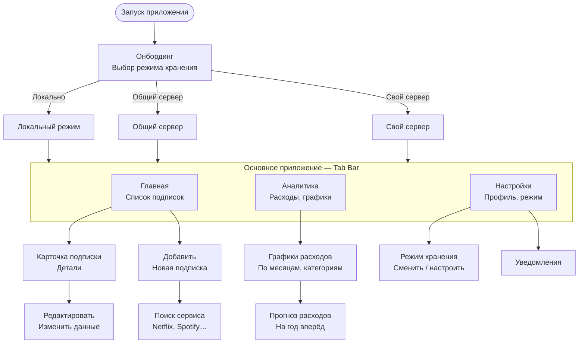

# SubRadar — Карта экранов

## Легенда

| Цвет | Группа экранов |
|---|---|
| Фиолетовый | Онбординг |
| Зелёный | Режимы хранения |
| Синий | Tab bar (основные вкладки) |
| Коралловый | Экраны подписок |
| Янтарный | Аналитика |
| Серый | Настройки |

## Открытые вопросы

- [ ] Уведомления о скором списании?
- [ ] Поддержка нескольких валют?
- [ ] Периоды оплаты: месяц / год / неделя / кастомный?
- [ ] Виджет для домашнего экрана iOS?
